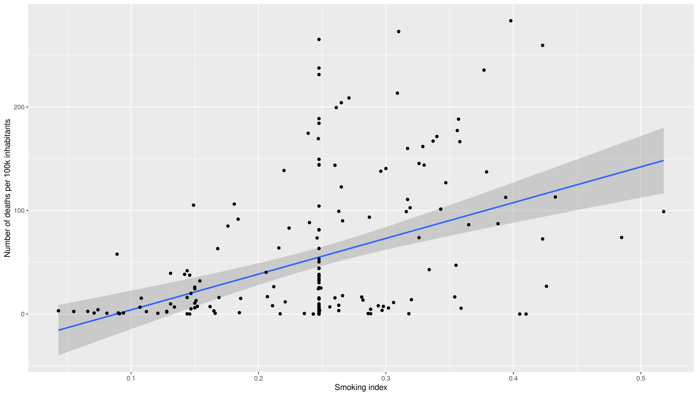
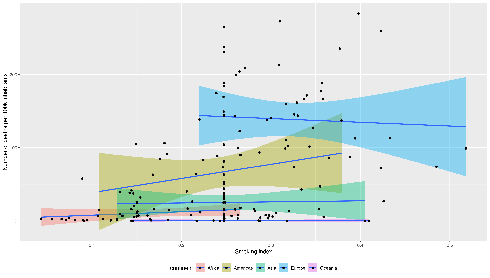
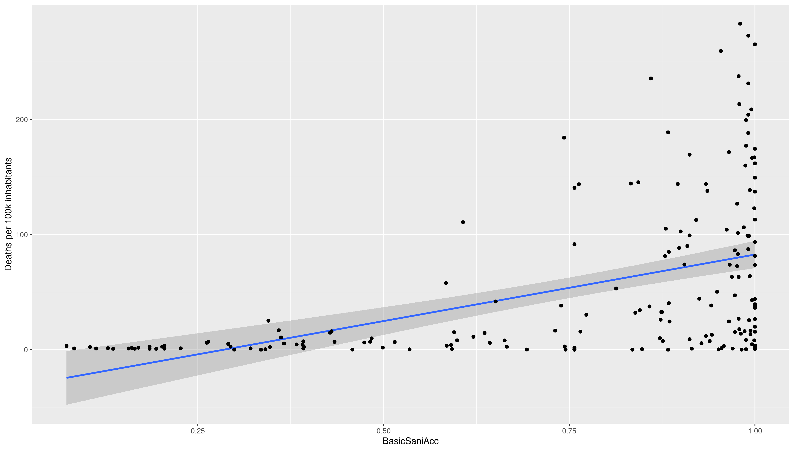
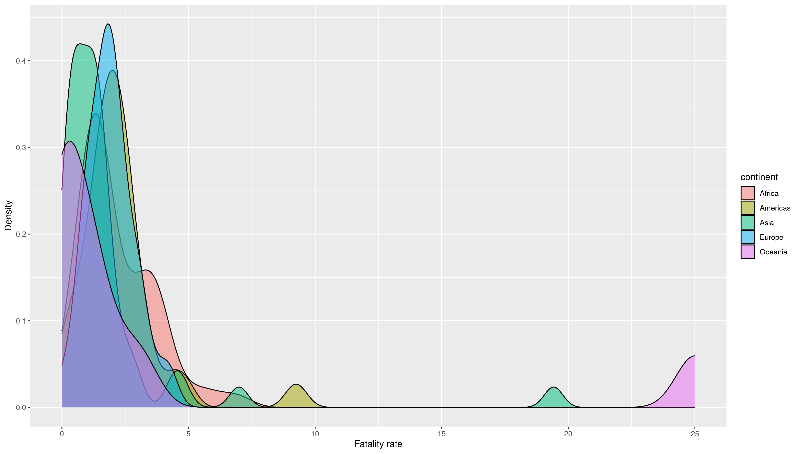
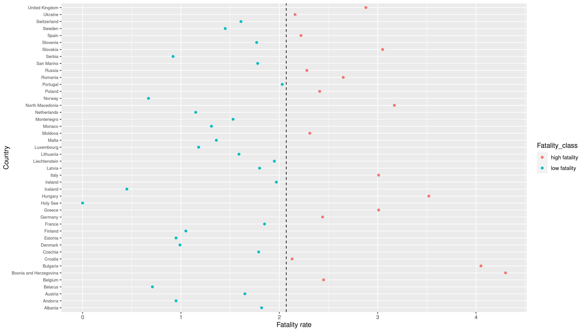

```{r setup, include=FALSE}
knitr::opts_chunk$set(echo = FALSE)
library("tidyverse")
```

## Index

- Introduction
- Methods
- Results
- Discussion
- Conclusion

## Introduction

For this project we merged data from two main sources: John Hopkins and Gapminder.

<div class="columns-2">
### John Hopkins data - [Repository Link](https://github.com/CSSEGISandData/COVID-19)

- Main datasets of the project
  - Time series of COVID-19 confirmed cases
  - Time series of COVID-19 deaths
  - Population count (IUD)
  


### Gapminder data - [Website Link](https://www.gapminder.org/data/)

- 18 datasets of varying relevance including:  
  - Life expectancy
  - Smoking and Alcohol Consumption
  - Body Mass Index and Basic Sanitation

</div>

## Introduction
COVID-19 has impacted differently in different countries and the reasons why this has been the case are still under investigation.
<center>

{height=40}

</center>
In our project we aim to analyze a set of variables affecting mostly all countries to elucidate which may be the factors affecting COVID-19 outbreak.
<center>

{height=40}

</center>
To do this we performed an exploratory analysis using different datasets

## Methods

{height=400}


## Methods
For the time series datasets we selected the Country/Region column and the number of cases reported the 29th April 2021.

The same procedure was appliad to dataset 02.
```{r, echo = FALSE, message = FALSE, results = 'hide'}

data01_pres <- read_tsv(file = "data/01_JH_01CovidCases.tsv")
```
```{r, echo = FALSE}
data01_pres
```

## Methods
For the rest of datasets we selected the country column and the most recent data (data from the last year registered).
```{r, echo = FALSE}
data06_raw <- read.csv(file = "data/_raw/06_Gap_smoking_adults_percent_of_population_over_age_15.csv")
data06_raw <- data06_raw  %>% 
  select(country, X2005) %>% 
  rename(Smoking = X2005)
data06_raw
```
Similar procedure for datasets 04 to 24.


## Methods

Then we grouped by country and sum the cases in the different regions of the same country.
```{r, echo=FALSE}
data01 <- data01_pres %>%
  group_by(Country) %>% 
  summarise_all(sum)
data01
```


## Methods


### Main cleaning tasks

- Join John Hopkins data by Country column
- Join Gapminder data by Country column
- Remove NA in Gapminder data by replacing by the mean
- Fix country names so they look the same in both datasets
- Join both datasets


## Methods
We added the following new attributes to the dataset:


- Cases per 100000 inhabitants: $\frac{Cases}{Population}100000$
- Deaths per 100000 inhabitants: $\frac{Deaths}{Population}100000$
- Fatality rate: $\frac{Deaths}{Cases}100$
- Population density: $\frac{Population}{Area}$
- Fatality class
  - Low fatality
  - High fatality
- BMI class for both genders

## Methods
```{r, echo=FALSE, message = FALSE}
library("patchwork")
data_clean_aug <- read_tsv(file = "data/03_analysis_1_clean_aug.tsv")
data_clean_aug
```

## Data analysis


## Data analysis

{height=400}


## Data analysis

{height=400}

## Data analysis

{height=400}

## Data analysis

{height=400}

## Data analysis

{height=400}

